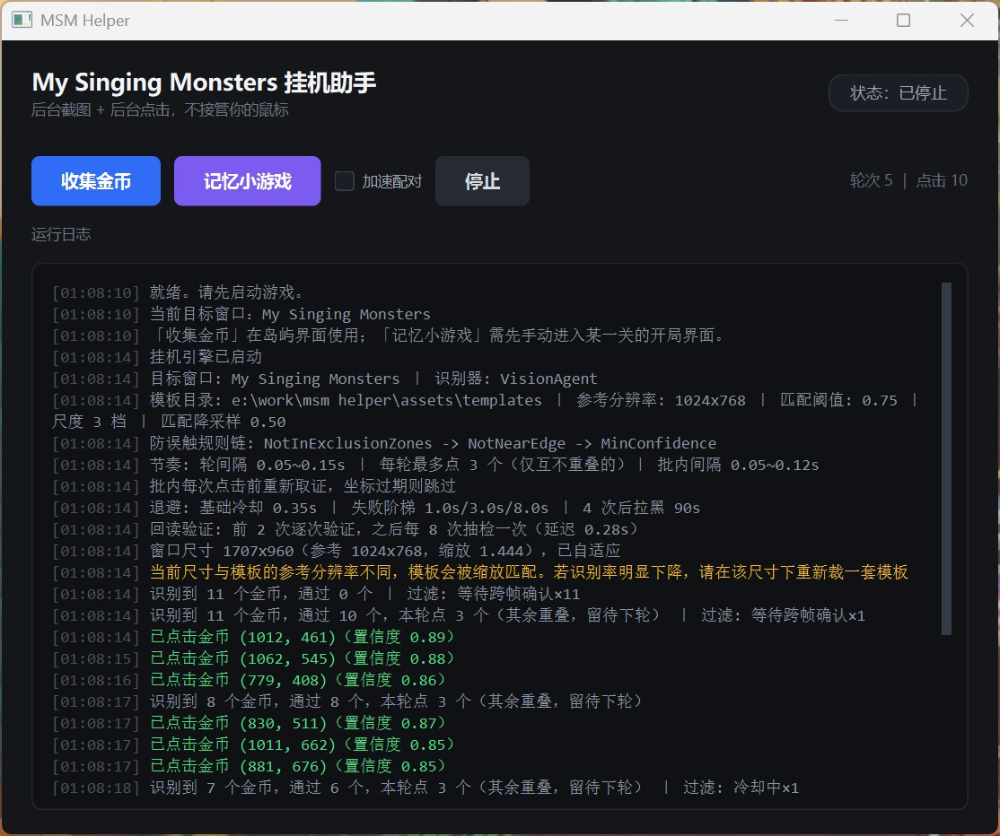
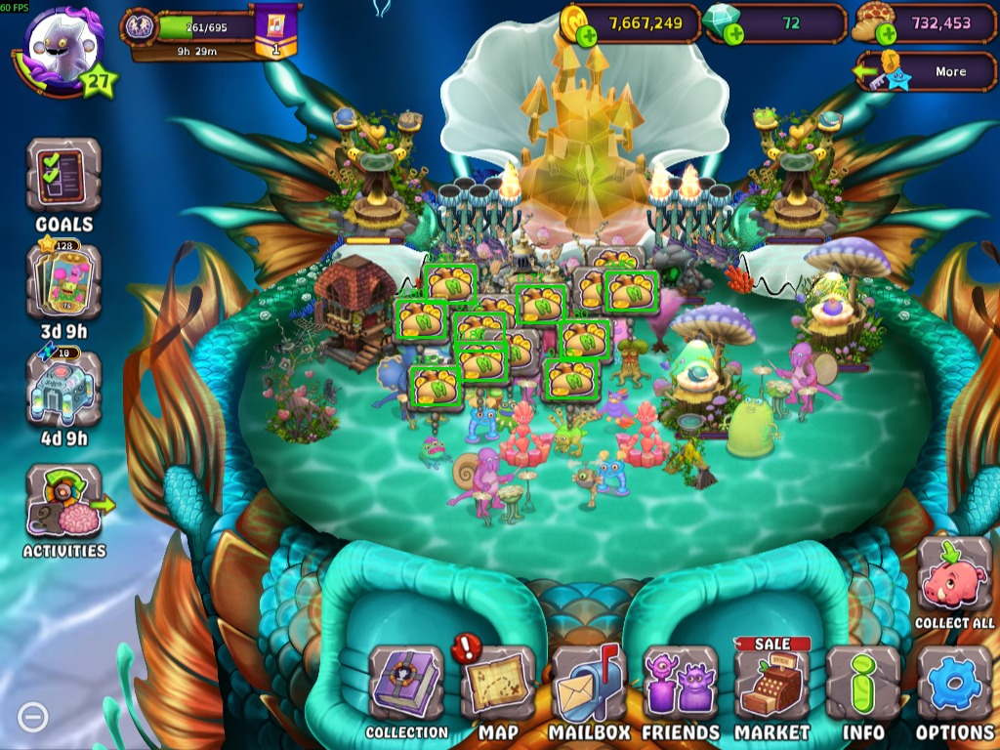
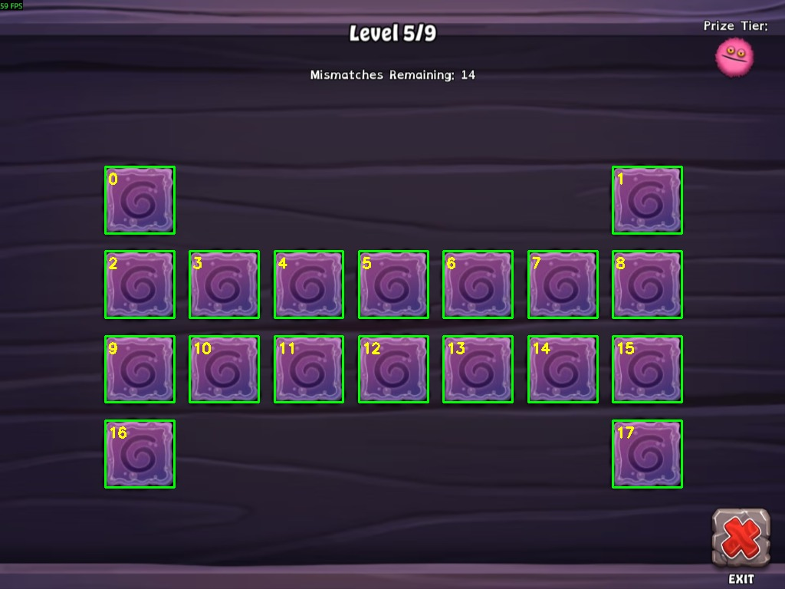

# MSM Helper

**English** | [简体中文](README.md)


A background automation helper for *My Singing Monsters* (Steam / Windows), built with Python, PySide6, and OpenCV.

Automates select in-game activities while never moving the physical mouse cursor or stealing foreground window focus. Even when completely occluded, the script continues to operate seamlessly without interrupting regular computer usage.

> **Disclaimer**: This is a personal technical exercise designed to demonstrate Windows background automation, computer vision, and the discipline of empirical calibration. Game automation may violate the *My Singing Monsters* terms of service; use it at your own risk. This project is not affiliated with or endorsed by Big Blue Bubble.
>
> **Development Model**: Developed via a modern Human-in-the-Loop pairing paradigm. The human developer steered the engineering roadmap, architectural decisions, formulated worst-case bounds and mathematical proofs, conducted live recordings, and performed physical verification; the AI agent handled asynchronous GUI construction, state-machine code implementation, runtime defect tracing & debugging, headless test suite construction, and statistical parameter calibration.

---

## Quick Start

### Requirements

| Dependency | Requirement / Recommended | Notes |
| :--- | :--- | :--- |
| **Operating System** | Windows 10 / 11 (64-bit) | Relies on low-level Win32 messaging and capture APIs |
| **Python** | 3.11+ | Core development and runtime environment |
| **Game Client** | Steam version of *My Singing Monsters* | Windowed mode, scale-adaptive (minimisation not supported) |

### Installation & Launch

```powershell
# 1. Clone the repository
git clone https://github.com/HinakoHanamura/my-singing-monsters-helper.git
cd my-singing-monsters-helper

# 2. Install dependencies
pip install -r requirements.txt

# 3. Launch the helper
python main.py
```

### Global Shortcuts

| Action | Shortcut | Usage Notes |
| :--- | :--- | :--- |
| **Collect Coins** | `F9` | Starts automated coin collection on the island view |
| **Memory Minigame** | `F11` | Manually enter the memory game board first before starting |
| **Stop** | `F10` | Safely stops the running background worker thread |

> Checking "加速配对" (Fast Reveal) enables the memory game's two-phase concurrent strategy (Recommended. Under the worst-case scenario, fast reveal incurs only one additional mismatch compared to standard mode).

---

## Demos

### 1. Main Interface
Modern dark UI with quick-start buttons for coin collection and the memory minigame, featuring a live diagnostic log.



### 2. Island Coin Collection
Multi-scale template matching with confidence ranking and non-overlapping candidate peel-down mechanisms.



### 3. Memory Card Minigame
Scale-invariant HSV color segmentation with row-band clustering to automatically recover reading order across dynamic arbitrary layouts.



---

## Core Features & Performance

| Feature | Status | Measured Performance | Technical Highlights |
| :--- | :--- | :--- | :--- |
| **Island Coin Collection** | Fully functional | ~**0.4-0.5 s / coin** (down from 2.1 s) | Downscaled template matching, layer-by-layer peeling, post-click verification |
| **Memory Card Minigame** | Clears all 9 levels | ~**1.10 s / card**, 21.1 s / level avg | Reading order clustering, dynamic face registry, concurrent two-card read |

> Note: The flip-back animation after a mismatch takes ~1.6 s, during which the game does not accept new flip inputs.

---

## Technical Architecture & Engineering Design

This project strictly follows a high-cohesion, low-coupling layered architecture driven by empirical methods:

| Architecture Layer | Core Module | Responsibilities |
| :--- | :--- | :--- |
| **UI Layer** | `ui/main_window.py` | PySide6 modern dark async interface, read-only logs and status display |
| **Control Layer** | `core/bot_engine.py` | `QThread` asynchronous main loop without blocking UI thread |
| **Guard Layer** | `core/validators.py`<br>`core/click_guard.py` | Environment rule chain, cross-frame tracking, and escalating backoff cooldown |
| **Algorithm Solvers** | `core/minigames/` | Row-band reading order recovery, dynamic face clustering, and solver state machine |
| **Perception Layer** | `core/vision_agent.py` | `BaseVisionAgent` unified contract, multi-scale template matching |
| **Action Layer** | `core/action_agent.py` | Win32 message-level background clicks with Gaussian position and timing jitter |
| **Geometry Layer** | `core/geometry.py` | Reference resolution (1024×768) to live-window scale adaptive mapping |
| **Window Layer** | `core/game_window.py` | GDI capture management, DPI thread context isolation, and black-padding stripping |

**[Read the Full MSM Helper Design Document (docs/DESIGN.en.md)](docs/DESIGN.en.md)**

---

## Testing & Quality Assurance

Comprehensive test suite that runs **without requiring a live game or visible Qt window**, supporting sub-second headless execution:

```powershell
python -m pytest tests/unit   # Run fast unit tests (410 tests)
python tools/run_suite.py     # Run full test suite (472 passed)
```

- **All 472 tests pass** across state machine proofs, geometry scaling, clustering, and UTF-8 recovery.
- Uses pure functions and dependency injection (`FakeBoard`, `FakeClock`) for high determinism.

---

## Known Limitations

| Area | Current State & Impact | Advice / Roadmap |
| :--- | :--- | :--- |
| **Fixed Camera Zoom** | Coin icons are screen-space sprites (constant size), but zoom changes visible area | Zoom out fully before running |
| **Multi-Resource Occlusion** | Diamonds and food icons overlap with coins, dropping local template scores | Current version peels by priority; full multi-resource recognition planned for future |
| **Platform Restriction** | Deeply relies on Win32 message queues and GDI/DirectX frame capture | Windows only; no cross-platform plan |

---

## Directory Layout

| Path | Description |
| :--- | :--- |
| `config.py` | Centralized configuration (tunables with empirical evidence) |
| `main.py` | Application entry point |
| `core/` | Core subsystems (window, geometry, perception, action, guard, engine) |
| `core/minigames/` | Memory minigame solvers and state machines |
| `ui/main_window.py` | PySide6 user interface |
| `tools/` | Calibration, benchmark, test runner, and diagnostic scripts |
| `tests/` | 472 headless unit and integration tests |
| `docs/DESIGN.en.md` | Technical Architecture & Design Document |
| `.agents/rules/` | Decision records, measured conclusions, and developer observations |

---

## Copyright

The code is copyrighted by the author. No open-source licence is granted. Commercial use, redistribution, or code reuse without express written permission is strictly prohibited.

`assets/templates/coin.png` and game screenshots in `docs/images/` remain the copyright of Big Blue Bubble and appear here solely for technical demonstration and explanatory purposes.
