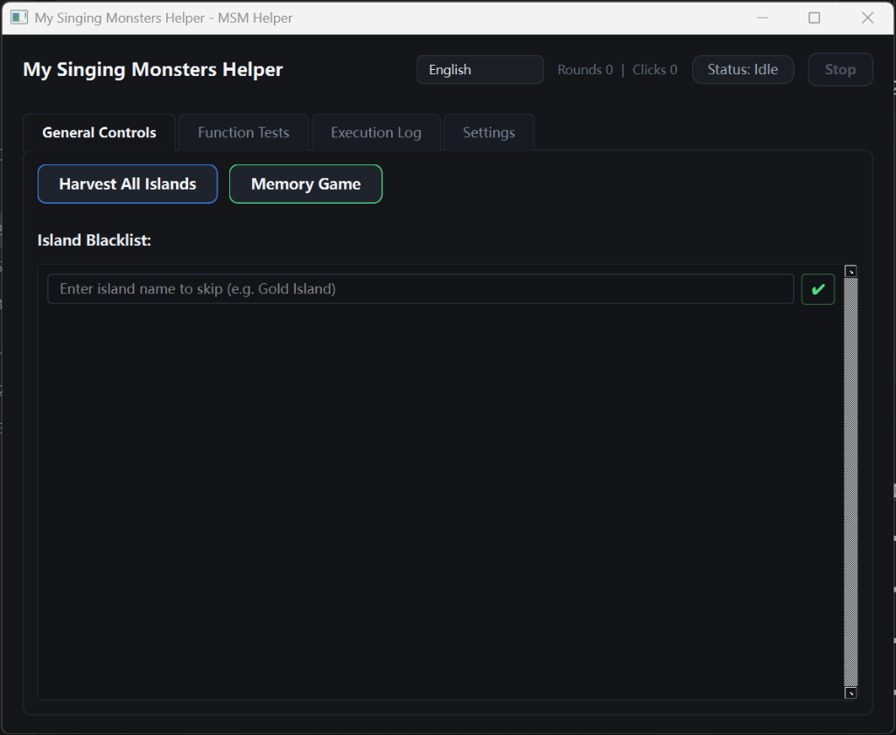

# MSM Helper

**English** | [简体中文](README.zh-CN.md)


An automation assistant for the Windows / Steam version of *My Singing Monsters*, built with Python, PySide6, and OpenCV. Utilizes pure Win32 background messaging (**never moves the physical mouse, never steals foreground focus**), allowing silent operation even when the game window is occluded. For optimal operation, please ensure the physical mouse cursor is kept outside the game window.
> **Disclaimer**: This is a personal technical practice project. Game automation may violate the Terms of Service of *My Singing Monsters*. Use at your own risk. This project is not affiliated with, endorsed by, or sponsored by Big Blue Bubble.
>
> **Development Model**: Developed using a modern Human-in-the-Loop (HITL) pair programming model.

---

## Quick Start

### 1. Requirements
- **OS**: Windows 10 / 11 (64-bit)
- **Python**: 3.11+
- **Game Client**: *My Singing Monsters* on Steam (Windowed mode, active rendering, do not minimize)

### 2. Installation & Launch
```bash
# Clone the repository
git clone https://github.com/HinakoHanamura/my-singing-monsters-helper.git
cd my-singing-monsters-helper

# Install dependencies
pip install -r requirements.txt

# Launch application
python main.py
```

---

## Features

- **Full Island Harvesting**: One-click autonomous patrol across all islands to collect coins, bakery treats, diamond mines, and piggy bank.
- **Memory Game**: One-click automated card matching and level completion upon entering the Memory Game.
- **Blacklist Management**: Custom list of islands to exclude during patrol tours, with dynamic editing and instant persistence.
- **Diagnostic Suite**: Granular single-island harvesting and specific target island search/tracking tools.
- **Languages**: Supports English and Chinese.

<p align="center">
  
</p>

---

## License

[MIT License](LICENSE).
