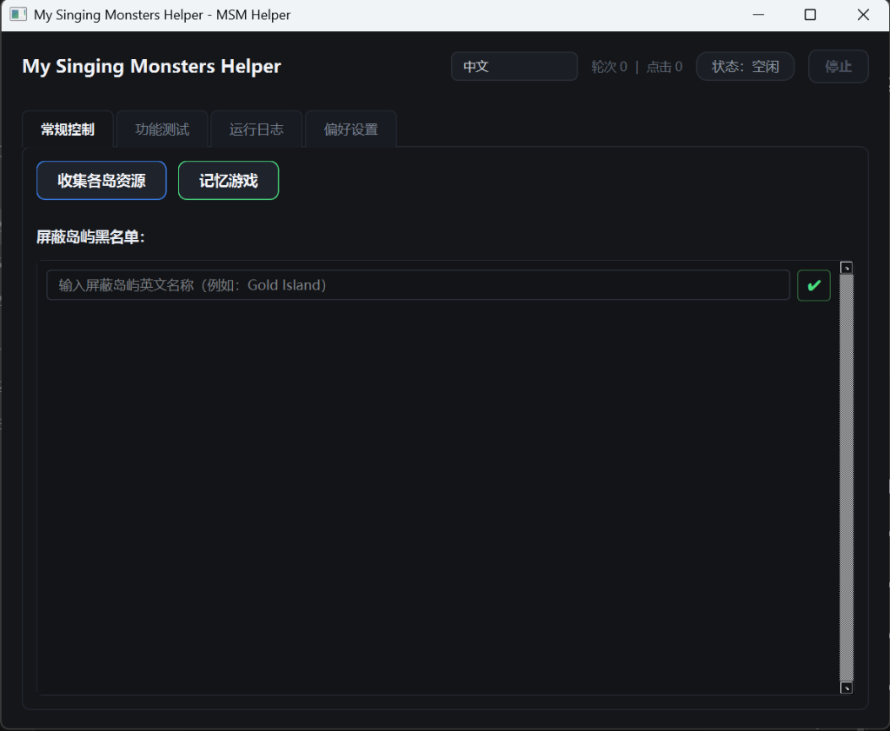

# MSM Helper

[English](README.md) | **简体中文**


《My Singing Monsters》（怪兽合唱团）Windows / Steam 版本的自动化辅助工具，基于 Python + PySide6 + OpenCV 构建。采用纯 Win32 后台消息机制，**不移动物理鼠标、不抢占前台焦点**，游戏窗口可以被遮挡。为了保证运行正常，请尽量保证鼠标指针不位于游戏画面内。
> **免责声明**：本项目为个人技术练习项目。游戏自动化可能违反《My Singing Monsters》的服务条款，使用风险自负。本项目与 Big Blue Bubble 没有任何关联，亦未获得其官方授权。
>
> **开发模式**：本项目采用现代人机协作（Human-in-the-Loop）开发模式。

---

## 快速开始

### 1. 前置环境
- **操作系统**：Windows 10 / 11 (64-bit)
- **Python**：3.11+
- **游戏客户端**：Steam 版《My Singing Monsters》（窗口化运行，保持渲染，不可最小化）

### 2. 安装与启动
```bash
# 克隆仓库
git clone https://github.com/HinakoHanamura/my-singing-monsters-helper.git
cd my-singing-monsters-helper

# 安装依赖
pip install -r requirements.txt

# 启动程序
python main.py
```

---

## 功能

- **全岛遍历收集**：一键全自动巡游全部岛屿，高效收集金币、食物、钻石矿及储蓄罐。
- **记忆游戏**：进入记忆游戏后一键启用全自动翻牌匹配通关。
- **黑名单管理**：支持自定义屏蔽岛屿列表，动态增删并持久化保存，巡岛过程自动跳过。
- **功能测试**：支持单岛单项资源收集测试与特定目标岛屿追踪测试。
- **语言**：支持中文和英文。

<p align="center">
  
</p>

---

## 许可证

[MIT License](LICENSE)。
